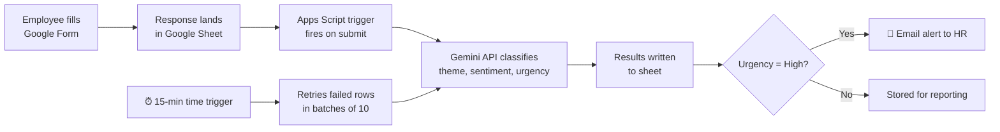

# 🧠 AI Feedback Insight Engine

**An AI-powered system that reads employee exit interviews and pulse surveys, classifies them by theme, sentiment and urgency, and alerts HR in real time when someone reports harassment.**

Built with Google Forms, Google Sheets, Google Apps Script and the Gemini API.

> ⚠️ This project uses **synthetic (sample) data** created for demonstration. No real employee data was used.

---

## 📌 The Problem

HR teams collect hundreds of open-text survey and exit interview responses, but reading them manually takes days, so most feedback is never analysed. Worse, a serious complaint like harassment can sit unnoticed in a spreadsheet for weeks.

My earlier project, an **Attrition Risk Flagging System**, identifies *who* might leave. This project answers the next question: ***why* are they leaving?**

## 💡 The Solution

An automated pipeline that:

1. Collects anonymous feedback through a Google Form (no names or emails collected).
2. Sends each response to the Gemini API with strict classification rules.
3. Writes **Theme, Sentiment, Urgency and a one-line summary** back into the sheet.
4. Emails HR **instantly** when a response is classified as High urgency.
5. Retries any failed rows automatically every 15 minutes.

## ⚙️ How It Works



## ✨ Key Features

| Feature | What it does | Why it matters |
|---|---|---|
| **Fixed theme taxonomy** | AI must choose from 11 predefined themes | Results stay consistent and comparable month to month |
| **Urgency rules** | High is reserved for harassment, threats, discrimination and serious distress | Prevents alert fatigue: normal workload complaints don't trigger alerts |
| **Structured JSON output** | AI returns machine-readable JSON, validated against allowed values | No broken parsing; unexpected values are flagged for manual review |
| **Batch processing** | Sends 10 feedbacks per API call | Reduced API calls by 90% (30 rows in 3 calls instead of 30) |
| **Retry + model fallback** | Exponential backoff (2s, 4s, 8s), then switches to a backup model | System keeps working during API outages |
| **Real-time HR alerts** | HTML email with department, theme, summary and a link to the row | Serious cases reach HR within minutes, not weeks |
| **Duplicate-alert prevention** | `Alert_Sent` column tracks which rows already triggered an email | HR never gets the same alert twice |
| **Concurrency lock** | `LockService` stops the form trigger and time trigger from processing the same row | Avoids duplicate processing |
| **Resumable runs** | `Processed` flag + 4.5-minute safety limit | Stays within Apps Script's 6-minute limit and resumes where it stopped |

## 🏷️ Theme Taxonomy

Workload & Burnout · Manager Behaviour · Compensation & Benefits · Career Growth · Work-Life Balance · Culture & Communication · Onboarding & Training · Tools & Resources · Harassment & Misconduct · Personal / External Reason · Positive Feedback

The taxonomy was **refined iteratively**: during testing, a complaint about broken equipment was being forced into "Culture & Communication", which revealed a gap. Adding "Tools & Resources" fixed it.

## 📊 Results

Tested on 33 responses (30 synthetic samples + 3 live form submissions):

- ✅ **5 of 5 high-risk cases** (harassment, threats, severe anxiety) correctly flagged as High urgency
- ✅ **0 false High alerts**: routine complaints (e.g. canteen food) did not trigger alerts
- ✅ **12 of 14 manually reviewed rows (86%)** matched my own classification; the remaining 2 were ambiguous and flagged for human review
- ⚡ **90% fewer API calls** through batch processing
- 📧 End-to-end alert delivered automatically, with no manual step, after a form submission

## 🛡️ Responsible AI & Privacy

- **Privacy by design:** the form collects no names, employee IDs or email addresses.
- **Data minimisation:** only the feedback text is sent to the AI; timestamps and metadata stay in the sheet.
- **Secrets protected:** the API key and HR email are stored in Script Properties, never in the code.
- **Human in the loop:** every alert states it was AI-generated and asks HR to review the original feedback before acting. The AI flags; a person decides.
- **Validation:** AI outputs outside the allowed values are replaced with "check manually" rather than trusted blindly.

## ⚠️ Limitations

- Some feedback genuinely fits more than one theme (e.g. positive culture comments could be "Culture" or "Positive Feedback"). These cases need human judgement.
- The taxonomy does not yet cover office facilities (canteen, parking), found during review. This is the next planned addition.
- On the free API tier, peak hours cause `503` busy errors. Retry logic handles this, but processing can be delayed.
- Alerts include the original feedback text; in a real deployment, the recipient list should be tightly restricted.
- Tested only on synthetic Hinglish/English data.

## 🛠️ Tech Stack

Google Forms · Google Sheets · Google Apps Script (JavaScript) · Gemini API · MailApp · LockService · Time-driven & form-submit triggers

## 🚀 Setup

1. Create a Google Form with: Survey Type, Department, Tenure, Overall Satisfaction (1–5), Main Feedback, Manager Experience, Anything Else. Turn **off** email collection.
2. Link the form to a new Google Sheet and add headers in columns I–O: `Theme`, `Sentiment`, `Urgency`, `AI_Summary`, `Processed`, `Human_Check`, `Alert_Sent`.
3. Open **Extensions → Apps Script** and paste the contents of `Code.gs`.
4. In **Project Settings → Script Properties**, add:
   - `GEMINI_API_KEY`: your key from [Google AI Studio](https://aistudio.google.com)
   - `HR_ALERT_EMAIL`: the address that should receive alerts
5. Run `testConnection` to confirm the API works.
6. Run `analyzeAllFeedback` to process existing rows.
7. Run `setupTriggers` once to enable real-time processing and automatic retries.

## 📁 Project Structure

```
ai-feedback-insight-engine/
├── Code.gs              # Complete Apps Script code
├── sample_data.csv      # 30 synthetic feedback responses
├── screenshots/         # Sheet output, alert email, logs, triggers
└── README.md
```

## 📸 Screenshots

<!-- Add your screenshots here. Blur any personal email addresses first. -->
| Classified responses | HR alert email |

| Retry & fallback in action | Automated triggers |

## 🔮 Coming Next

- Weekly AI-written summary email for HR leadership
- Looker Studio dashboard showing themes by department over time
- "Facilities & Workplace" theme based on review findings

## 👩‍💻 Author

Reetu · Aspiring Analyst

*Related project: [Attrition Risk Flagging System](#)*
